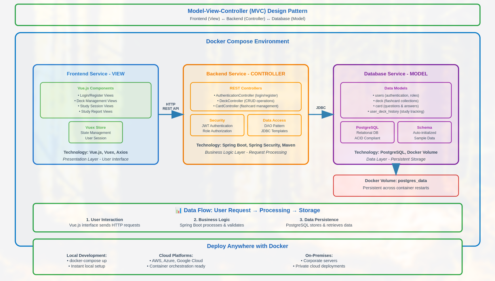
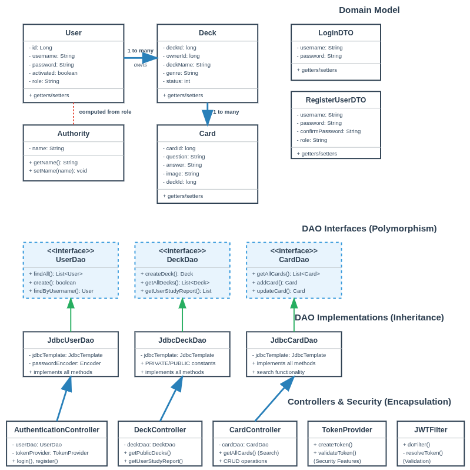
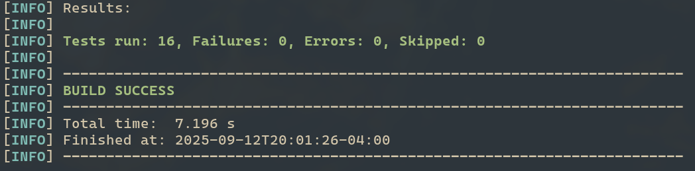

## A. Introduction

This was a Capstone project for my degree at Western Governor's University. \
I took a hacky type of approach by having everything run in the same dockerfile for the image, \
but this drastically simplified deployment and reduced costs VS mounted cloud storage.

This was deployed on AWS [here](http://flashcard-alb-2037441729.us-east-1.elb.amazonaws.com/)

## Table of Contents

B. [Full Stack Software Product](#b-full-stack-software-product)
   - [System Architecture Overview](#system-architecture-overview)
   - [Object-Oriented Design Architecture](#object-oriented-design-architecture)

C. [Documentation](#c-documentation)
   - [Prerequisites](#prerequisites)
   - [Installation Steps](#installation-steps)
   - [General Workflows](#general-workflows)

D. [Testing](#d-testing)


## B. Full Stack Software Product

### System Architecture Overview

The Ninja Flashcards application implements the Model-View-Controller (MVC) architectural pattern to separate concerns across its distributed three-tier system. The MVC pattern organizes the application into Models that represent data and business logic, Views that handle user interface presentation, and Controllers that manage request processing and coordinate between the other layers.



The Model layer consists of Java entities like `User`, `Deck`, and `Card` that encapsulate business data with validation rules and relationships. These model classes work in conjunction with Data Access Object (DAO) implementations that handle database persistence operations through Spring's JdbcTemplate. The View layer utilizes Vue.js components such as `DeckList.vue`, `Card.vue`, and `DeckForm.vue` to render the user interface and capture user interactions, with Nginx serving as the web server that delivers these components and routes HTTP REST API requests to the backend services, exposing the entire application through port 80 as configured in the Docker Compose deployment. The Controller layer employs Spring Boot REST controllers including `AuthenticationController`, `DeckController`, and `CardController` to process incoming HTTP requests, invoke appropriate business logic through the DAO layer, and return structured JSON responses to the frontend components.

The application leverages Docker Compose to orchestrate all three services with host networking, enabling in-network communication between containers while maintaining deployment consistency across different environments. This containerized approach ensures that the application behaves identically whether deployed locally, in cloud environments, or on production systems.

###Object-Oriented Design Architecture



The Ninja Flashcards application implements object-oriented design through three core principles: encapsulation, inheritance, and polymorphism. These principles work together to create a maintainable and scalable architecture.

Encapsulation is demonstrated throughout the model classes where private fields protect internal data from unauthorized access. The `User` class encapsulates sensitive information like passwords using the `@JsonIgnore` annotation to prevent accidental exposure during JSON serialization. All model classes (`User`, `Deck`, `Card`) use private fields with public getter and setter methods to control data access.

```java
public class User {
    private Long id;
    private String username;
    @JsonIgnore
    private String password;
    private Set<Authority> authorities;
    
    public Long getId() { return id; }
    public void setId(Long id) { this.id = id; }
}
```

The security layer further demonstrates encapsulation by isolating authentication logic within specialized classes like `TokenProvider` and `JWTFilter`, preventing other components from accessing sensitive JWT processing details.

Inheritance is implemented through the DAO layer using interface contracts. The `UserDao`, `DeckDao`, and `CardDao` interfaces define method contracts that concrete implementations must follow. The `JdbcUserDao` class implements the `UserDao` interface, inheriting all method signatures while providing JDBC-specific implementations.

```java
public interface UserDao {
    List<User> findAll();
    User getUserById(Long userId);
    boolean create(String username, String password, String role);
}

@Component
public class JdbcUserDao implements UserDao {
    private final JdbcTemplate jdbcTemplate;
    // Implements all interface methods with JDBC logic
}
```

This inheritance pattern allows the application to swap different data access implementations without affecting the business logic.

Polymorphism enables flexible component interaction through abstract interfaces. Controllers depend on DAO interfaces rather than concrete implementations, allowing Spring's dependency injection to resolve the appropriate implementation at runtime. The `DeckController` accepts any `DeckDao` implementation through its constructor, demonstrating polymorphic behavior.

```java
@RestController
public class DeckController {
    private DeckDao deckDao;
    
    public DeckController(DeckDao deckDao) {
        this.deckDao = deckDao;
    }
    
    public List<Deck> getAllDecks() {
        return deckDao.getAllDecks(); // Calls concrete implementation
    }
}
```

The application follows the Model-View-Controller (MVC) architectural pattern with a data access layer. The Model layer contains the core business entities: `User` represents application users with authentication details, `Deck` represents flashcard collections with ownership and privacy settings, and `Card` represents individual flashcards with questions and answers. These models establish clear relationships where users own multiple decks, each deck contains multiple cards, each card is unique to it's deck.

The View layer is implemented through the Vue.js frontend application that renders the user interface. Vue components like `DeckList`, `Card`, and `DeckForm` handle presentation logic and user interactions, while the frontend communicates with the backend through REST API calls that get routed to the `postgres` instance automatically with Nginx.

The Controller layer exposes REST endpoints that handle HTTP requests and responses. The `AuthenticationController` manages user registration and login with JWT token generation, the `DeckController` handles deck CRUD operations and study session tracking, and the `CardController` manages individual flashcard operations. All controllers use Spring Security annotations for method-level access control.

The Data Access Layer implements the repository pattern through DAO interfaces (`UserDao`, `DeckDao`, `CardDao`) with corresponding JDBC implementations that use Spring's `JdbcTemplate` for database operations. This separation allows controllers to work with clean interfaces while keeping SQL queries isolated in the implementation classes.

## C. Documentation

### Prerequisites
- Docker
- Docker Compose
- Git

### Installation Steps

1. **Clone the repository**
```bash
git clone https://gitlab.com/wgu-gitlab-environment/student-repos/lnines/d424-software-engineering-capstone
cd d424-software-engineering-capstone
git switch working_branch
```

2. **Start the application**
```bash
docker-compose up -d --build
```
Wait for 

3. **Access the application**
Open your browser to: http://localhost:80

4. **Stop the application when finished**
```bash
# will remove associated volume
docker-compose down -v 
```

The application runs on a single port (80) with all services containerized and automatically configured.

### General Workflows

#### User Registration & Authentication
1. Click "Login" in navigation
2. Click "Create Account" to register new user
3. Fill registration form with username/password
4. Login with credentials after account creation

#### Deck Management
1. Navigate to "My Decks" (requires login)
2. Click "Create Deck" to make new deck
3. Configure deck details: name, genre, description, privacy status
4. Add cards with questions and answers
5. Save changes using "Save Deck Details"

#### Study Sessions
1. Browse "Public Decks" or access personal decks
2. Click "Start" on any deck to begin study session
3. Click cards to flip and reveal answers
4. Mark answers as "Correct" or "Wrong"
5. Use "Save Score" to track performance (requires login)

#### Performance Tracking
1. Access "Study Report" from navigation (requires login)
2. View comprehensive performance analytics
3. Review brain color indicators `🟢 Green = Excellent, 🟡 Yellow = Good, 🔴 Red = Needs Improvement`
4. Track study history with timestamps and scores

#### Deck Sharing & Privacy
- **Private (🔒)**: Only visible to owner
- **Unlisted (🥷)**: Accessible via direct link sharing
- **Public (👥)**: Visible in community directory

Change privacy settings in deck edit form using the Status dropdown.

## D. Testing

The test suite consists of three test classes with distinct responsibilities. `CompleteWorkflowIntegrationTest.java` validates end-to-end user workflows including authentication, authorization, and cross-user access attempts. `ActualControllerTest.java` tests individual controller endpoints for CRUD operations on decks and cards, verifying HTTP status codes and response bodies. `ModelUnitTest.java` validates domain model behavior including entity relationships, data validation, and business logic constraints. Together these tests ensure the application functions correctly from the DAO implementations through the REST controllers.

```java
@Test
public void testUnauthorizedUserCannotAccessProtectedEndpoints() {
    mockMvc.perform(delete("/api/deck/123"))
           .andExpect(status().isUnauthorized());
    mockMvc.perform(get("/api/deck/myDecks/456"))
           .andExpect(status().isUnauthorized());
}
```

Running the initial test suite exposed a critical security flaw. Eight of sixteen tests failed with 403 Forbidden errors, but not for the right reason. The `@PreAuthorize` annotations on controller methods weren't being enforced at all. Spring Security was configured with `anyRequest().permitAll()` and missing the crucial `@EnableGlobalMethodSecurity(prePostEnabled = true)` annotation, which meant anyone knowing an endpoint URL could perform any operation. In production, this would allow unauthenticated users to delete any deck with `DELETE /api/deck/123`, modify any card with `PUT /api/card/456`, or access private user data with `GET /api/deck/myDecks/789`.

The fix required creating `SecurityConfig.java` with proper layered security. The configuration now explicitly defines which endpoints are public (`/api/register`, `/api/login`, GET `/api/deck/public`) while requiring authentication for everything else. The missing `@EnableGlobalMethodSecurity(prePostEnabled = true)` annotation was added to activate method-level security checks.

```java
@Configuration
@EnableGlobalMethodSecurity(prePostEnabled = true)
public class SecurityConfig extends WebSecurityConfigurerAdapter {
    @Override
    protected void configure(HttpSecurity http) {
        http.authorizeRequests()
            .antMatchers("/api/register", "/api/login").permitAll()
            .antMatchers(HttpMethod.GET, "/api/deck/public").permitAll()
            .anyRequest().authenticated();
    }
}
```

The tests also revealed that authenticated users could access other users' private decks by simply changing the userId in the URL. The original `@PreAuthorize("hasAnyRole('USER', 'ADMIN')")` only checked if someone was logged in, not if they owned the data. This required creating `DeckSecurityService.java` to handle complex authorization logic beyond simple role checks. The service implements methods like `canRead()`, `canModify()`, and `canDelete()` that check deck ownership, privacy status, and admin privileges.

```java
@Service("deckSecurity")
public class DeckSecurityService {
    public boolean canRead(Long deckId, Authentication auth) {
        int status = getDeckStatus(deckId);
        if (status == 2 || status == 3) return true;  // Public/unlisted
        if (status == 1) return isAdmin(auth) || isOwner(deckId, auth);  // Private
        return false;
    }
    
    public boolean canModify(Long deckId, Authentication auth) {
        if (!isAuthenticated(auth)) return false;
        return isAdmin(auth) || isOwner(deckId, auth);
    }
}
```

The application now properly blocks unauthenticated requests at the HTTP layer and validates ownership at the method layer through the security service. After implementing these security measures, all sixteen tests pass. This can be verified by running `./mvnw test` in the `java/` directory. 

```bash
cd java
./mvnw test
```



